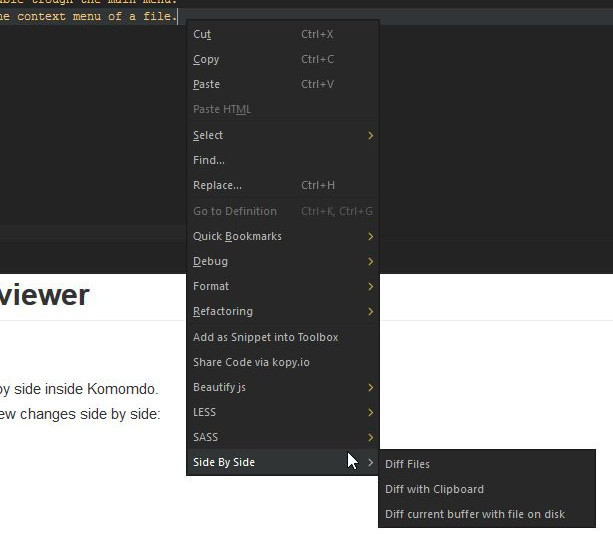

# Side-By-Side

A side by side Diffviewer for Komodo Edit/Ide

## Side by Side Diff viewer

Add's the ability to view changes side by side inside Komodo.  
The addons provide three options to view changes side by side:  
 * Diff files
 * Diff current file with clipboard
 * Diff current buffer with file on disk  

For changes on both sides the diff viewer provides a inline diff.  
Also the addon contains a copy functionality.
 
## Inline Diff 
For changes where both sides has changes, when you click on the diff.   
A inline diff viewer will appear:

In this diff window you can diff the chances by character or by word.

## Copy functionality
In the main diff window, when you click on the deleted or inserted chunk.  
This chunk will be copied to the clipboard.

In the inline diff window you can copy the left or right change trough the buttons in the top left window.  
You can also copy the inserted chunck inside the inline diff by clicking on it:

 
## Menu options

The side by side diff is available trough the main menu.  
But is also available trough the context menu of a file.

## Key bindings
For easy access, you can also set up your custom key bindings:

## Credits
This adddon is build with:
 * [jsdiff](https://github.com/kpdecker/jsdiff)
 * [jsdifflib](https://github.com/cemerick/jsdifflib)
